```{r, echo=FALSE, message=FALSE}
library(knitr)
library(fontawesome)
```


```{r analysis, include=FALSE, cache=TRUE}

# load packages -----------------------------------------------------------
library(ISLR2)
library(tidyverse)
library(selectnn)

# load data ---------------------------------------------------------------
data(Boston)

df <- Boston

# split into traning and test ---------------------------------------------
set.seed(6464371)
forTraining <- caret::createDataPartition(df$medv,
                                          p = 0.8)[[1]]
trainingSet <- df[forTraining,]
testSet <- df[-forTraining,]


# prep data --------------------------------------------------------

std <- caret::preProcess(trainingSet, method = 'range')
X_train <- as.matrix(predict(std, trainingSet))[, -ncol(df)]
X_test <- as.matrix(predict(std, testSet))[, -ncol(df)]

y_train <- as.matrix(predict(std, trainingSet))[, ncol(df)]
y_test <- as.matrix(predict(std, testSet))[, ncol(df)]

Boston = as.data.frame(cbind(X_train, y_train))

colnames(Boston)[13] <- 'medv'

Boston <- Boston[, -c(10)]

nn <- selectnn(medv ~ ., data = Boston, Q = 10, n_init = 10, maxit = 5000)

X <- nn$X
nn_nnet <- nnet::nnet(X, Boston$medv, Wts = nn$W_opt, size = nn$q,
                      trace = FALSE, linout = TRUE, maxit = 0) 

library(statnnet)
stnn <- statnnet(nn_nnet, X)  
summary(stnn)

```

class: title-slide, left, bottom

# `r rmarkdown::metadata$title`
----
## **`r rmarkdown::metadata$author`**, **`r rmarkdown::metadata$coauthor`**
### `r rmarkdown::metadata$institution`
#### `r rmarkdown::metadata$event`, `r rmarkdown::metadata$date`

???

I am funded by SFI CRT in FDS.
This is a multi-institutional collaboration between UL, UCD and MU.
The goal of the centre is to fuse and blend the fundamentals of applied mathematics
machine learning, and statistics.
My research focuses on the combination of the latter two, where I'm looking at
a statistical-modelling based approach to neural networks.
So, neural networks are typically implemented as black-box models in machine
learning, but taking a statistical perspective, I want to show how these models
have similarities to the models traditionally used in statistical model.

---

# Agenda


--

- Feedforward Neural Networks


--

- Statistical Perspective

--

- Model Selection

--

- Statistical Interpretation

--
 
- R Implementation

--

<br>

Slides: [bit.ly/rss-fnn-stat](https://bit.ly/rss-fnn-stat)   Code: [bit.ly/rss-fnn-stat-code](https://bit.ly/rss-fnn-stat-code)

---
class: inverse middle center subsection
# Feedforward Neural Networks

---

# Background

Attempts to model the brain.

Idea that our brains consists of synapses and neurons.

McCulloch and Pitts, Rosenblatt, Hinton.

???

Neural networks origniated from early attempts to model the human brain.
The idea was that if we could replicate the process that the human brain uses
for learning through an algorithm, then we could achieve artificial intelligence.
Our brains are made up of over 86 billion neurons, which are connected together 
by over 1,000 trillion synapses, which send signals.

The idea, credited to McCulloch and Pitts, was to create a single neuron model
and use it to solve problems.

---

# Background

Interest within the statistics community in the late 1980s and early 1990s.

Comprehensive reviews provided by White, Ripley, Cheng and Titterington.

However, majority of research took place outside the field of statistics
Brieman, Hooker and Mentch.

---

# Feedforward Neural Networks 

--

.pull-left[ 
```{r, echo=FALSE, out.width="90%", out.height="110%", fig.align="center"}
knitr::include_graphics("img/FNN.png")
``` 
]

<br>

<br>

--

$$
\begin{equation}
\text{NN}(x_i) = \gamma_0+\sum_{k=1}^q \gamma_k \phi \left( \sum_{j=0}^p \omega_{jk}x_{ji}\right)
\end{equation}
$$

---

# Motivating Example

--

### Boston Housing Data (Kaggle)

--

506 communities in Boston, MA.    

--

 
Response: 

- `medv` (median value of owner-occupied homes)    

--

12 Explanatory Variables:  

- `rm` (average number of rooms per dwelling)  

- `lstat` (proportion of population that are disadvantaged)

---

# R Implementation: nnet

--

```{r nnet, echo = TRUE, eval = FALSE}
library(nnet)
nn <- nnet(medv ~ ., data = Boston, size = 8, maxit = 5000,
           linout = TRUE)
summary(nn)
```

--

```{r nnetmodel, eval = TRUE, echo = FALSE, class.output = "bg-primary"}
library(nnet)
set.seed(1010101)
nnet_model <- nnet(medv ~ ., data = Boston, size = 8, maxit = 5000,
                   linout = TRUE, trace = FALSE)
cat(c(capture.output(summary(nnet_model))[c(3:10)], "[...]"),
    sep = "\n") 
```


---
class: inverse middle center subsection
# Statistical Perspective

---

# Statistical Perspective

--

$$
y_i = \text{NN}(x_i) + \varepsilon_i, 
$$

--

where

$$
\varepsilon_i \sim N(0, \sigma^2)
$$

<br>

--

$$
\ell(\theta)= -\frac{n}{2}\log(2\pi\sigma^2)-\frac{1}{2\sigma^2}\sum_{i=1}^n(y_i-\text{NN}(x_i))^2
$$

---

# Uncertainty Quantification

Then, as $n \to \infty$

$$
\hat{\theta} \sim N[\theta, \Sigma = \mathcal{I}(\theta)^{-1}]
$$

--

Estimate $\Sigma$ using

$$
\hat{\Sigma} = I_o(\hat{\theta})^{-1}
$$

--

<br>  

However, inverting $I_o(\hat{\theta})$ can be problematic in neural networks.
---

# Redundancy

--

Redundant hidden nodes can lead to issues of unidentifiability for some of the parameters (Fukumizu 1996).

<br>

--

Redundant hidden nodes $\implies$ Singular information matrix.

<br>

--

Model selection is required.


---
class: inverse middle center subsection
# Model Selection

---

# Model Selection

```{r, echo=FALSE, out.width="65%", fig.align="center"}
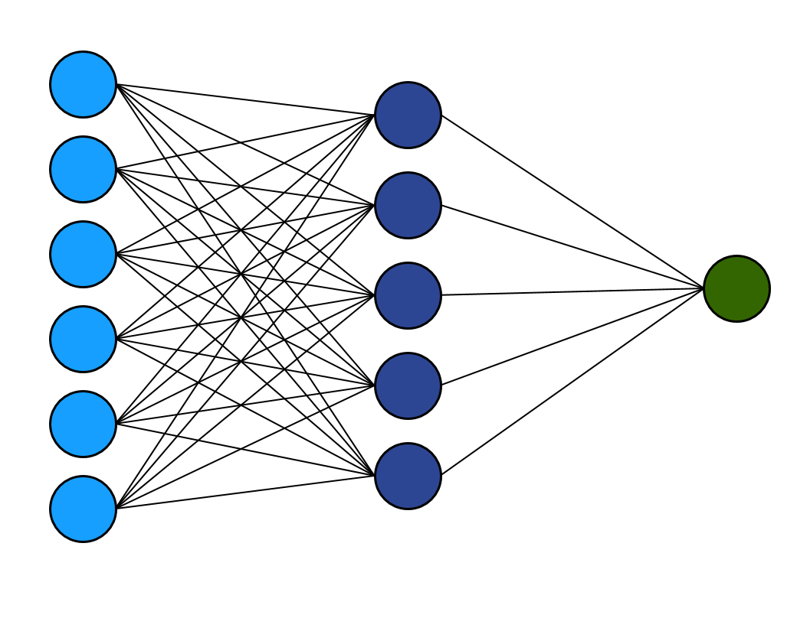
``` 

---
count: false
# Model Selection


```{r, echo=FALSE, out.width="65%", fig.align="center"}
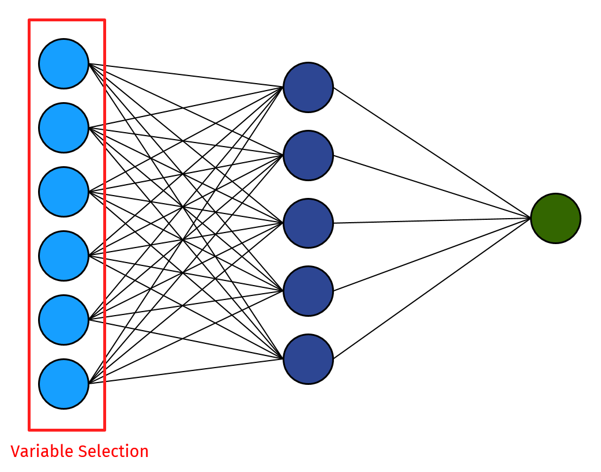
``` 

---
count: false
# Model Selection


```{r, echo=FALSE, out.width="65%", fig.align="center"}
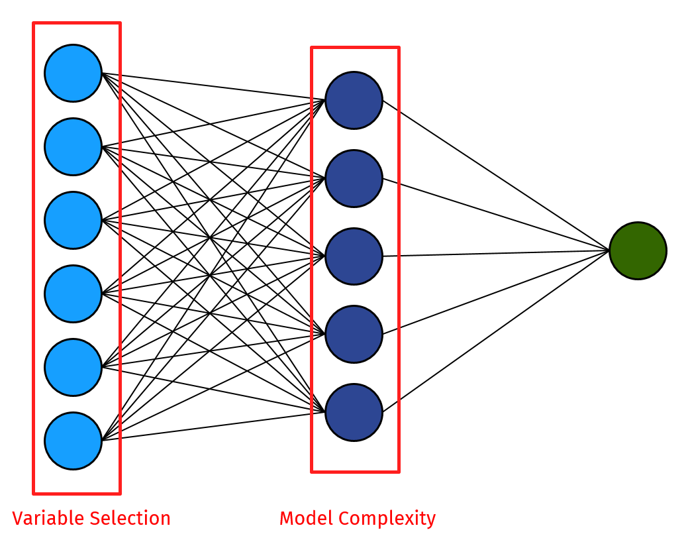
``` 

---
# Proposed Approach

.pull-left[
```{r, echo=FALSE, out.width="100%", fig.align="center"}
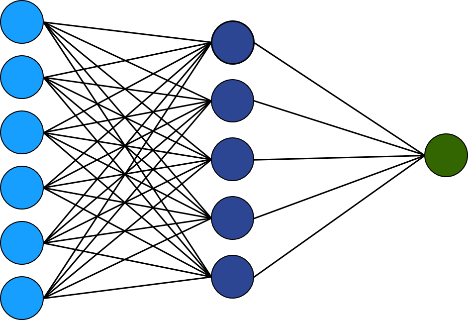
``` 
]
--
.pull-right[
Three phases for model selection:

{{content}}
]

--

1. Hidden-node selection
{{content}}


--

2. Input-node selection
{{content}}

--

3. Fine tuning
{{content}}

---
# Proposed Approach

--
.center[
<figcaption>Hidden Node Selection</figcaption>
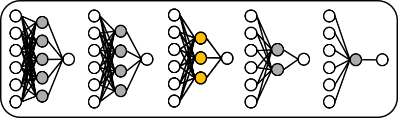
]
--
.center[
<figcaption>Input Node Selection</figcaption>
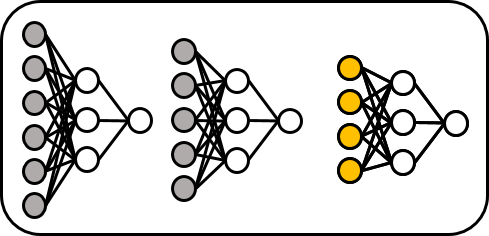
]
--
.center[
<figcaption>Fine Tune</figcaption>
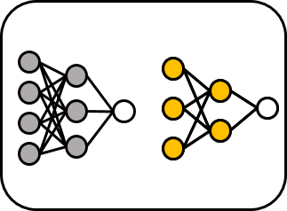
]
---

# Objective Function

--

- Machine Learning:

--

$$
\begin{equation}
\text{Out-of-Sample MSE} = \frac{1}{n_\text{val}}\sum_{i=1}^{n_\text{val}} (y_i - NN(x_i))^2
\end{equation}
$$


--

- Proposed:

--


$$
\begin{equation}
\text{BIC} = -2\ell(\hat{\theta}) + \log(n)(K + 1),
\end{equation}
$$

--

$$
\begin{equation}
K = (p+2)q+1
\end{equation}
$$

---

# Simulation Setup


.pull-left[
<br>


True Model: $p = 3$, $q = 3$

]

---
count: false
# Simulation Setup


.pull-left[
<br>


True Model: $p = 3$, $q = 3$


<br>

No. unimportant inputs: $10$


]


---
count: false
# Simulation Setup


.pull-left[
<br>


True Model: $p = 3$, $q = 3$


<br>

No. unimportant inputs: $10$


<br>

Max no. hidden nodes: $10$

]

--

.pull-right[
```{r, echo=FALSE, out.width="90%", fig.align="center"}
knitr::include_graphics("img/simFNN.png")
``` 
]


# Simulation Results: Approach

--

```{r, echo=FALSE, out.width="65%", fig.align="center"}
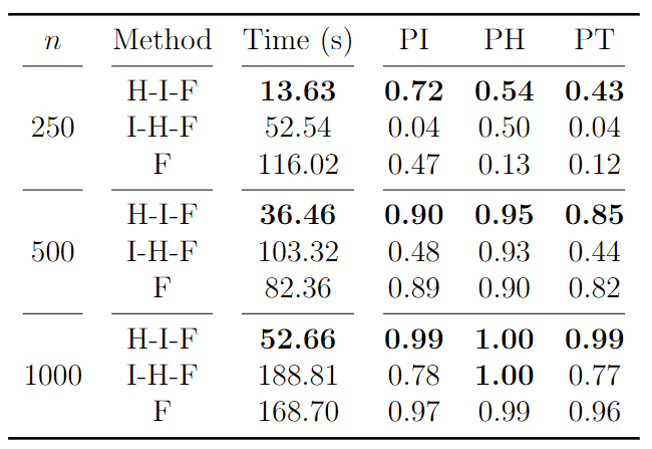
``` 

---
# Simulation Results: Objective Function

--

```{r, echo=FALSE, out.width="50%", fig.align="center"}
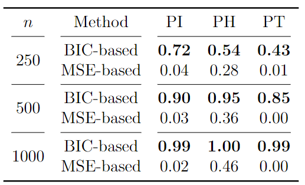
``` 

--
```{r, echo=FALSE, out.width="70%", fig.align="center"}
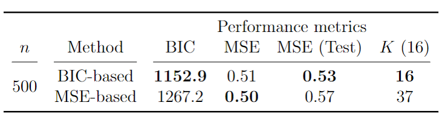
```

---
class: inverse middle center subsection
# Statistical Interpretaion


---

# Hypothesis Testing

--

.pull-left[
```{r, echo=FALSE, out.width="100%", fig.align="center"}

``` 
]

---
count: false
# Hypothesis Testing


.pull-left[
```{r, echo=FALSE, out.width="100%", fig.align="center"}
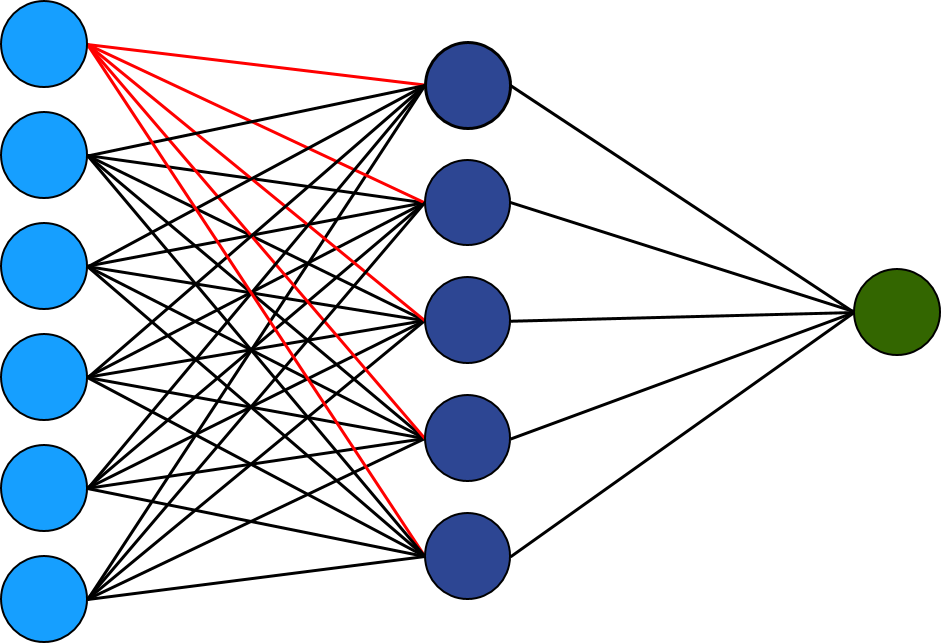
``` 
]

--

.pull-right[
  Wald test:
  
  {{content}}
  
  ]

--

$$
\begin{equation}
 \omega_j = (\omega_{j1},\omega_{j2},\dotsc,\omega_{jq})^T
\end{equation}
$$
{{content}}

--

$$
\begin{equation}
 H_0: \omega_j = 0
\end{equation}
$$
{{content}}

--

$$
\begin{equation}
 (\hat{\omega}_{j} - \omega_j)^T\Sigma_{\hat{\omega}_{j}}^{-1}(\hat{\omega}_{j} - \omega_j) \sim \chi^2_q
\end{equation}
$$
{{content}}


---

# Simple Covariate Effect

<br>

--

$$
\begin{equation}
  \hat{\tau_j} = E[\text{NN}(X)|x_{(j)} > a] - E[\text{NN}(X)|x_{(j)} < a]
\end{equation}
$$

<br>

--


Usually set $a = m_j$, where $m_j$ is the median value of covariate $j$

--

<br>

Associated uncertainty via delta method / bootstrapping

---

# Covariate-Effect Plots


$$
\begin{equation}
 \overline{\text{NN}}_j(x) = \frac{1}{n}\sum_{i=1}^n \text{NN}(x_{(i,1)}, \ldots,x_{(i,j-1)},x, x_{(i,j+1)}, \ldots, x_{(i,p)})
\end{equation}
$$

--
Propose covariate-effect plots of the following form:

--

$$
\begin{equation}
 \hat{\beta}_j(x,d) = \overline{\text{NN}}_j(x + d) - \overline{\text{NN}}_j(x)
\end{equation}
$$

--

Usually set $d = \text{SD}(x_j)$

--

Associated uncertainty via delta method.

---
class: inverse middle center subsection
# R Implementation


---


# R Implementation

--

.left-column[ 
<br>
```{r, echo=FALSE, out.width="80%", fig.align="center"}

``` 
]

--

.right-column[
<br>
<br>
```{r, echo=TRUE, eval = FALSE}
# install.packages("devtools")
library(devtools)
install_github("andrew-mcinerney/statnnet")
``` 
]


---

# Data Application (Revistied)

### Boston Housing Data (Kaggle)

506 communities in Boston, MA.   

--

 
Response: 

- `medv` (median value of owner-occupied homes)    

--

12 Explanatory Variables:  

- `rm` (average number of rooms per dwelling)  

- `lstat` (proportion of population that are disadvantaged)

---

# Boston Housing: Model Selection 


```{r selection, echo = TRUE, eval = FALSE}
library(statnnet)
nn <- selectnn(medv ~ ., data = Boston, Q = 10,
               n_init = 10, maxit = 5000)
summary(nn)
```

--

```{r summ, echo = FALSE, cache = TRUE, class.output = "bg-primary"}
cat(c(capture.output(summary(nn))[c(1:23)], "[...]"), sep = "\n")  

```

---

# Boston Housing: Model Comparison

```{r, echo=FALSE, out.width="95%", fig.align="center"}
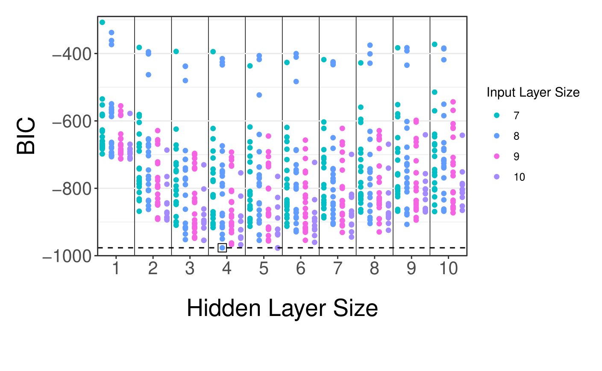
``` 

---

# Boston Housing: Model Comparison
```{r, echo=FALSE, out.width="95%", fig.align="center"}
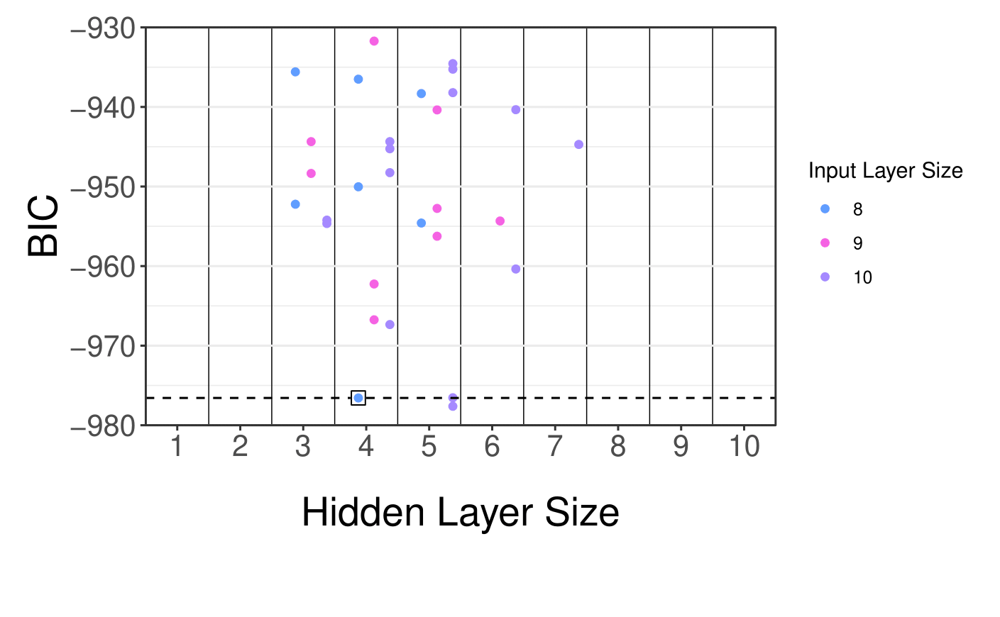
``` 


---

# Boston Housing: Model Summary 


```{r stnn, message = FALSE, eval = FALSE, tidy = FALSE}
stnn <- statnnet(nn)  
summary(stnn)
```

--

```{r summst, echo = FALSE, cache = TRUE, class.output = "bg-primary"}
cat(c("[...]", capture.output(summary(stnn))[12:24]), sep = "\n")  
```


---

# Boston Housing: Simple Effects

```{r, echo=FALSE, out.width="90%", fig.align="center"}
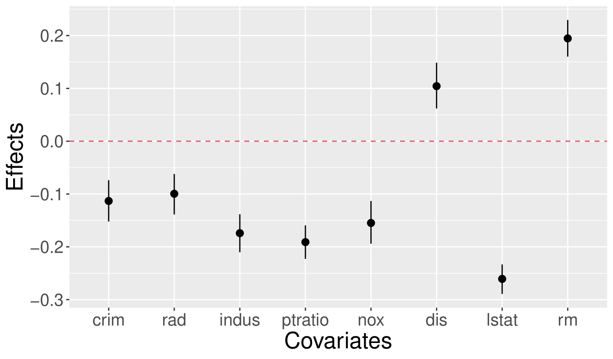
``` 

---

# Boston Housing: Covariate-Effect Plots 

```{r, eval = FALSE}
plot(stnn, conf_int = TRUE, method = "deltamethod", which = c(4, 8))
```  

--

.pull-left[ 
```{r plot1, cache = TRUE, echo = FALSE, fig.height = 6}
par(mar=c(5,6,4,2)+.1)
plot(stnn, conf_int = TRUE, method = "deltamethod", x_axis_r = c(0, 1), 
       which = 4, cex.caption = 2, cex.lab = 1.75, cex.axis = 1.5, caption = "")
# axis(1, c(0, 0.2, 0.4, 0.6, 0.8, 1), labels = 3.5:8.5, pos = -0.035)
axis(3, seq(0, 1, length.out = 5), labels = seq(3.5, 8.5, length.out = 5), 
     cex.axis = 1.5)
```  
]  

--

.pull-right[ 
```{r plot2, cache = TRUE, echo = FALSE, fig.height = 6}
par(mar=c(5,6,4,2)+.1)
plot(stnn, conf_int = TRUE, method = "deltamethod", x_axis_r = c(0, 1), 
     which = 8, cex.caption = 2, cex.lab = 1.75, cex.axis = 1.5, caption = "")
# axis(1, seq(0, 1, length.out = 5), labels = seq(2, 38, length.out = 5),
#      pos = -0.155)
axis(3, seq(0, 1, length.out = 5), labels = seq(2, 38, length.out = 5), 
     cex.axis = 1.5)
```  
] 

---
class: final-slide
# Summary 


Feedforward neural networks are non-linear regression models.  

--

Calculation of a likelihood function allows for uncertainty quantification.

--

Our R package extends existing neural network packages
to allow for a more interpretable, statistically-based output.


---

class: final-slide
# References

Fukumizu, K. (1996).
A regularity condition of the information  
matrix of a multilayer perceptron network. Neural Networks,  
9(5):871–879. 

McInerney, A. and Burke, K. (2022).
A Statistically-Based Approach  
to Feedforward Neural Network Model Selection.
arXiv preprint arXiv:2207.04248.


### R Package  

```{r, eval = FALSE}
devtools::install_github("andrew-mcinerney/statnnet")
```

`r fa(name = "github", fill = "#007DBA")` <font size="5">andrew-mcinerney</font>   `r fa(name = "twitter", fill = "#007DBA")` <font size="5">@amcinerney_</font> `r fa(name = "envelope", fill = "#007DBA")` <font size="5">andrew.mcinerney@ul.ie</font>


